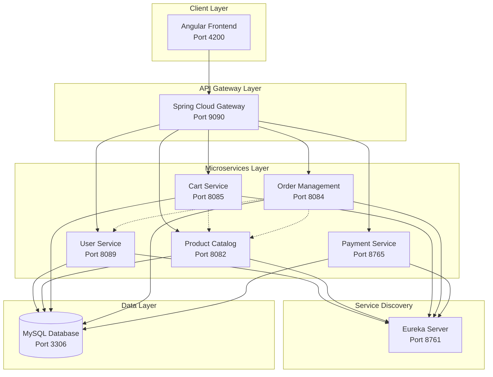
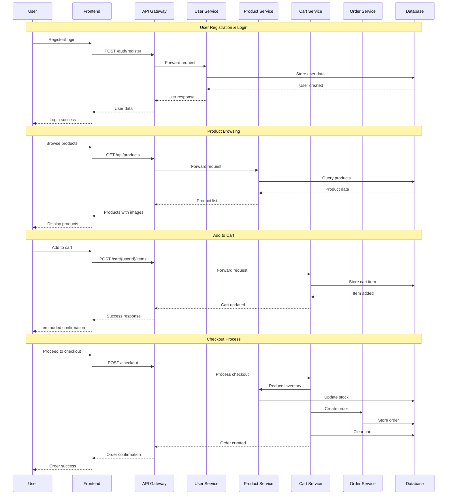
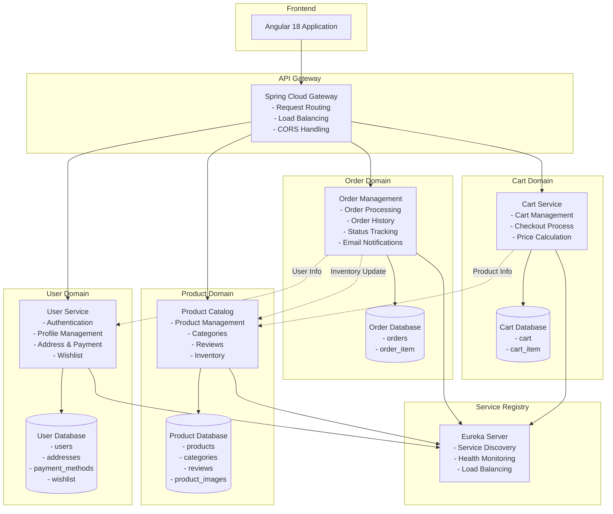
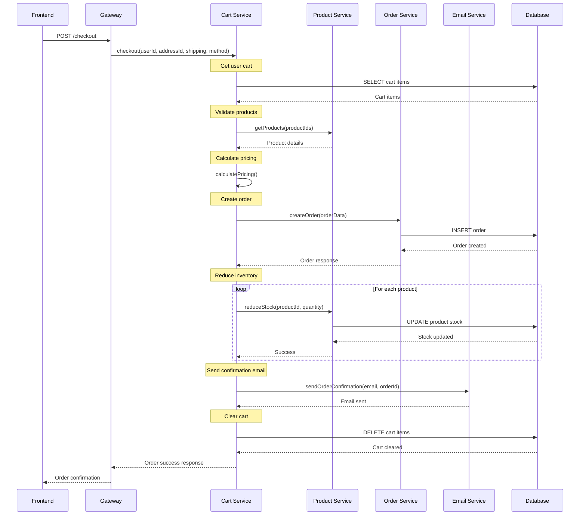
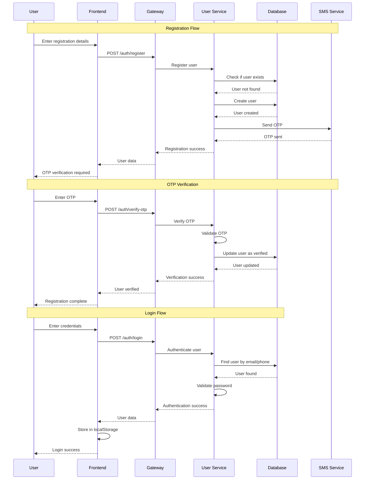
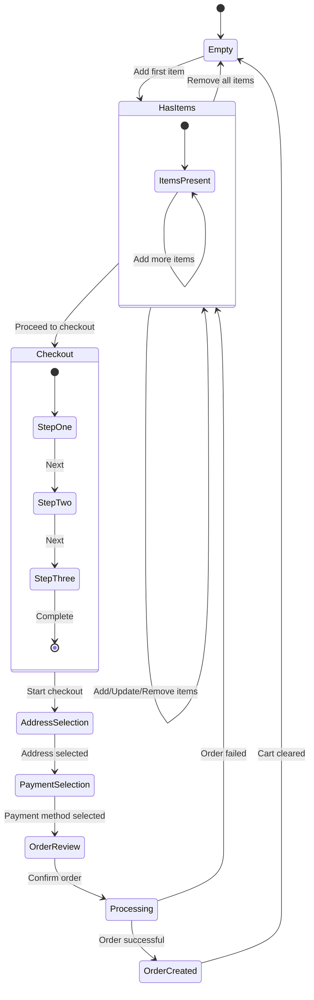
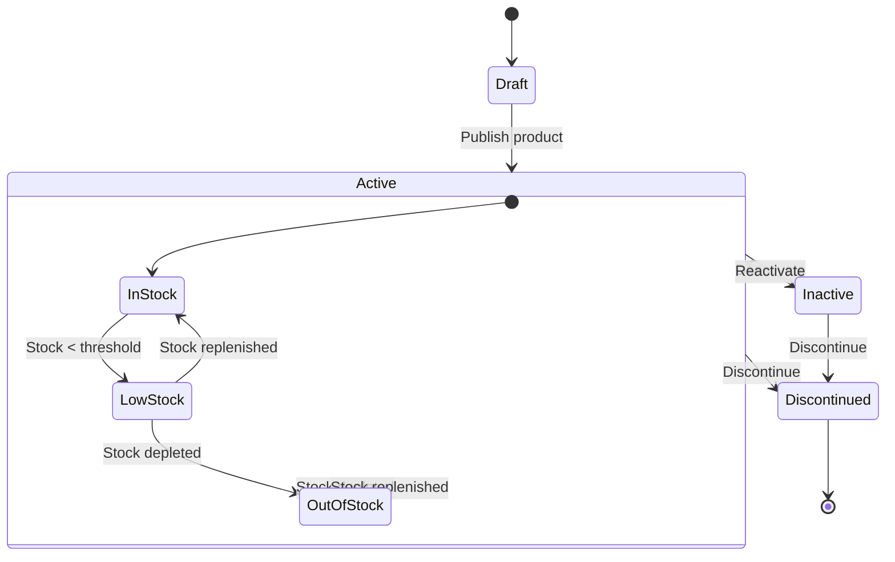
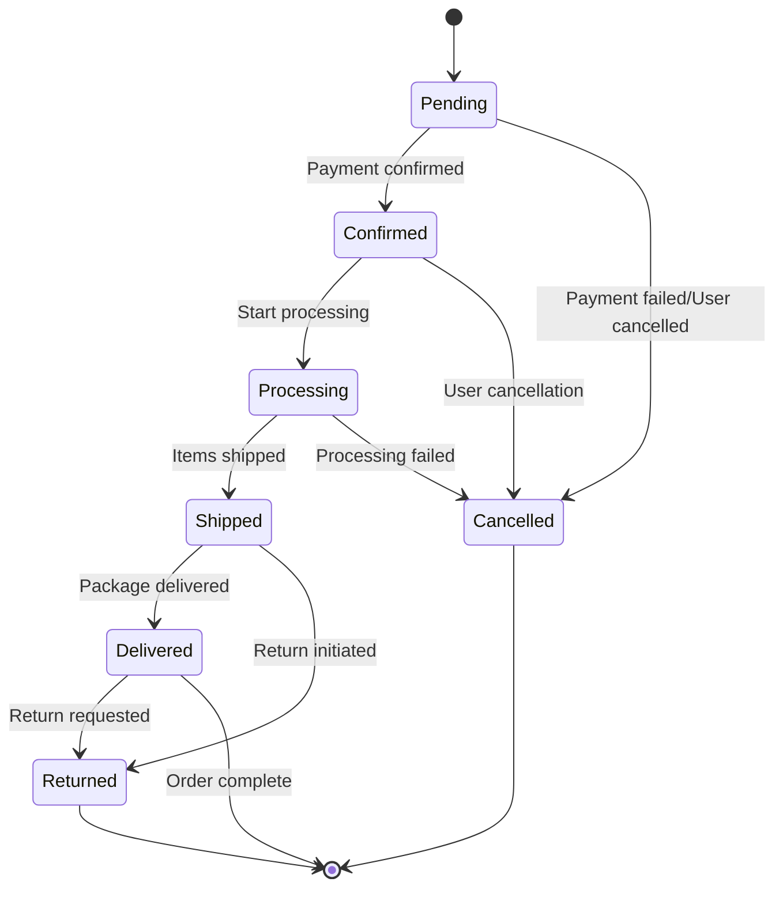
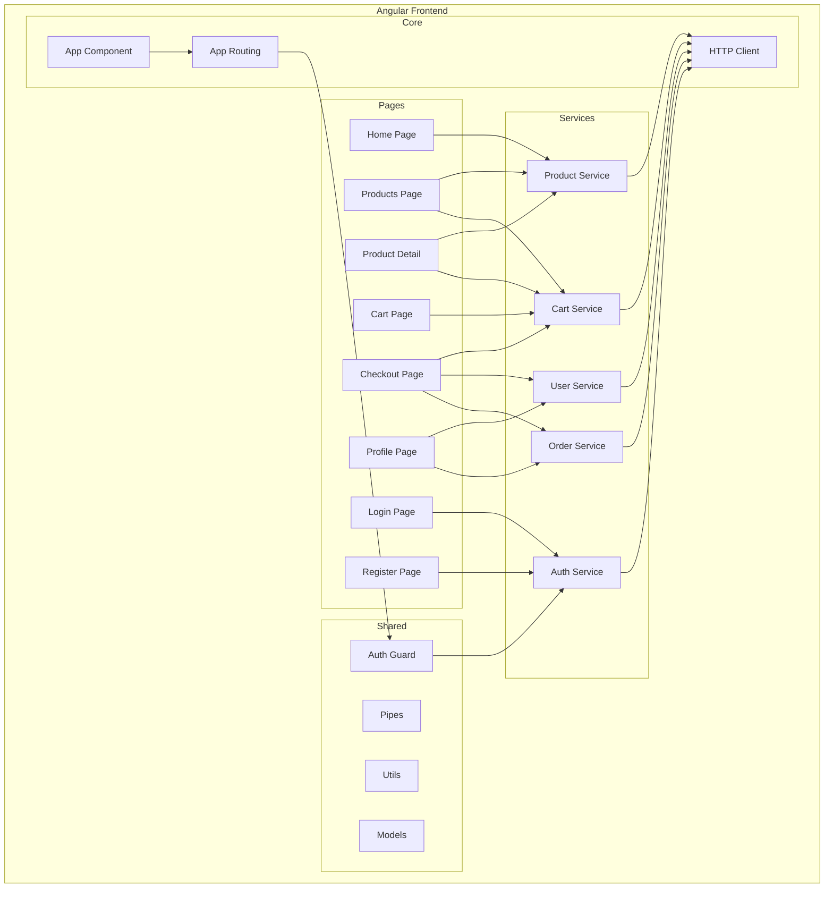

# UML Diagrams - E-Commerce Platform

## 🎯 Overview

This document contains comprehensive UML diagrams for the e-commerce microservices platform, including system architecture, workflows, and detailed service interactions.

---

## 🏗️ System Architecture Diagram



---

## 🔄 User Journey Workflow



---

## 🏛️ Microservices Architecture



---

## 📊 Class Diagram - User Service

```mermaid
classDiagram
    class User {
        -Long id
        -String email
        -String phone
        -String password
        -String name
        -String avatar
        -Boolean mfaEnabled
        -LocalDateTime createdAt
        -LocalDateTime updatedAt
        +getId() Long
        +setEmail(String) void
        +validatePassword(String) boolean
    }
    
    class Address {
        -Long id
        -Long userId
        -String fullName
        -String phone
        -String line1
        -String line2
        -String city
        -String state
        -String postalCode
        -String country
        -Boolean isDefault
        +getFullAddress() String
        +setAsDefault() void
    }
    
    class PaymentMethod {
        -Long id
        -Long userId
        -String provider
        -String token
        -Boolean isDefault
        -LocalDateTime createdAt
        +maskToken() String
        +isExpired() boolean
    }
    
    class Wishlist {
        -Long id
        -Long userId
        -Long productId
        -LocalDateTime createdAt
        +isProductInWishlist(Long) boolean
    }
    
    class AuthController {
        -AuthService authService
        +register(RegisterRequest) ResponseEntity
        +login(LoginRequest) ResponseEntity
        +verifyOtp(OtpRequest) ResponseEntity
    }
    
    class UserController {
        -UserService userService
        +getAddresses(Long) ResponseEntity
        +addAddress(Long, Address) ResponseEntity
        +getPaymentMethods(Long) ResponseEntity
        +addPaymentMethod(Long, PaymentMethod) ResponseEntity
        +getWishlist(Long) ResponseEntity
        +addToWishlist(Long, Long) ResponseEntity
    }
    
    User ||--o{ Address : has
    User ||--o{ PaymentMethod : has
    User ||--o{ Wishlist : has
    AuthController --> User : manages
    UserController --> User : manages
    UserController --> Address : manages
    UserController --> PaymentMethod : manages
    UserController --> Wishlist : manages
```

---

## 📦 Class Diagram - Product Catalog

```mermaid
classDiagram
    class Product {
        -Long id
        -String sku
        -String name
        -String brand
        -String description
        -BigDecimal price
        -String currency
        -Integer stock
        -AvailabilityStatus availabilityStatus
        -Boolean active
        -Map~String,String~ specifications
        -Set~Category~ categories
        -List~ProductImage~ images
        -List~Review~ reviews
        +reduceStock(Integer) boolean
        +isAvailable() boolean
        +getAverageRating() Double
    }
    
    class Category {
        -Long id
        -String name
        -String description
        -Set~Product~ products
        +getProductCount() Integer
    }
    
    class ProductImage {
        -Long id
        -byte[] imageData
        -String imageUrl
        -String contentType
        -String altText
        -Integer sortOrder
        -Product product
        +getImageUrl() String
        +hasImageData() boolean
    }
    
    class Review {
        -Long id
        -Long productId
        -Long userId
        -String userName
        -String userAvatar
        -Integer rating
        -String title
        -String comment
        -Boolean verifiedPurchase
        -Integer helpfulCount
        -LocalDateTime createdAt
        +isPositive() boolean
        +getFormattedDate() String
    }
    
    class ProductController {
        -ProductService productService
        +getAllProducts() ResponseEntity
        +getProductById(Long) ResponseEntity
        +reduceStock(Long, Integer) ResponseEntity
        +uploadImage(Long, MultipartFile) ResponseEntity
        +getImage(Long) ResponseEntity
    }
    
    Product }|--|| Category : belongs to
    Product ||--o{ ProductImage : has
    Product ||--o{ Review : has
    ProductController --> Product : manages
```

---

## 🛒 Class Diagram - Cart Service

```mermaid
classDiagram
    class Cart {
        -Long id
        -Long userId
        -List~CartItem~ items
        -Instant updatedAt
        +addItem(CartItem) void
        +removeItem(Long) void
        +updateQuantity(Long, Integer) void
        +clear() void
        +getTotalItems() Integer
    }
    
    class CartItem {
        -Long id
        -Cart cart
        -Long productId
        -Integer quantity
        -String variant
        -Instant createdAt
        -Instant updatedAt
        +getLineTotal(BigDecimal) BigDecimal
        +updateQuantity(Integer) void
    }
    
    class CartController {
        -CartService cartService
        -PricingService pricingService
        +getCart(Long) ResponseEntity
        +addItem(Long, Long, Integer, String) ResponseEntity
        +updateItem(Long, Long, Integer) ResponseEntity
        +removeItem(Long, Long) ResponseEntity
        +getPrice(Long) ResponseEntity
    }
    
    class CheckoutController {
        -CheckoutService checkoutService
        +checkout(Long, Long, String, String) ResponseEntity
    }
    
    class PriceDto {
        -BigDecimal subtotal
        -BigDecimal tax
        -BigDecimal shipping
        -BigDecimal discount
        -BigDecimal grandTotal
        +calculateTax() BigDecimal
        +calculateShipping() BigDecimal
    }
    
    Cart ||--o{ CartItem : contains
    CartController --> Cart : manages
    CheckoutController --> Cart : processes
    CheckoutController --> PriceDto : calculates
```

---

## 📋 Class Diagram - Order Management

```mermaid
classDiagram
    class Order {
        -Long id
        -String orderId
        -Long customerId
        -String customerEmail
        -Double totalAmount
        -Double subtotal
        -Double shipping
        -Double tax
        -Double discount
        -OrderStatus status
        -LocalDateTime orderDate
        -LocalDateTime estimatedDelivery
        -String shippingFullName
        -String shippingPhone
        -String shippingAddressLine1
        -String paymentType
        -String paymentDetails
        -List~OrderItem~ items
        +calculateTotal() Double
        +canBeCancelled() boolean
        +updateStatus(OrderStatus) void
    }
    
    class OrderItem {
        -Long id
        -Order order
        -Long productId
        -String productName
        -String productImage
        -Integer quantity
        -Double price
        -Double total
        +getLineTotal() Double
    }
    
    class OrderStatus {
        <<enumeration>>
        PENDING
        CONFIRMED
        PROCESSING
        SHIPPED
        DELIVERED
        CANCELLED
    }
    
    class OrderController {
        -OrderService orderService
        +createOrder(Map) ResponseEntity
        +getOrder(String) ResponseEntity
        +getOrdersByUser(Long) ResponseEntity
        +updateOrder(String, Order) ResponseEntity
        +cancelOrder(String) ResponseEntity
        +trackOrder(String) ResponseEntity
    }
    
    Order ||--o{ OrderItem : contains
    Order --> OrderStatus : has
    OrderController --> Order : manages
```

---

## 🔄 Sequence Diagram - Order Creation Flow



---

## 🔐 Authentication Flow Diagram



---

## 🛍️ Shopping Cart State Diagram



---

## 📦 Product Lifecycle Diagram



---

## 🔄 Order Status Flow Diagram



---

## 🏗️ Component Diagram - Frontend Architecture



---

This comprehensive UML documentation provides visual representations of the system architecture, workflows, and detailed service interactions for the e-commerce platform.